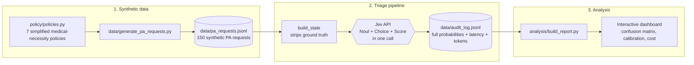

# Prior-Authorization Triage with Jev

A proof of concept: using [TypeSafe AI's Jev](https://typesafe.ai/blog/introducing-system-one-models-and-jev) — a "System One" decision model, not an LLM — to triage prior-authorization (PA) requests in a payer utilization-management pipeline.

**[→ Live results dashboard](https://claude.ai/code/artifact/eb46f18d-aaff-4dd8-a644-63a4bb0935c4)**

> Synthetic data only. No real patients, members, claims, or payer policy documents were used anywhere in this project. This is an illustrative proof of concept, not a validated clinical or coverage decision system — see [Disclaimers](#disclaimers).

## The problem

Prior authorization is the most-hated workflow in U.S. health insurance: providers submit a request, it sits in a queue, a reviewer eventually works through a policy checklist, and days or weeks later a decision comes back. Delays cause real harm, and the last few years have brought intense scrutiny — lawsuits, state investigations, and public backlash — specifically over *opaque, automated* denial decisions.

That scrutiny is the reason this POC is deliberately **not** "let an AI approve or deny prior auth." It's a triage system: given a request and the applicable medical-necessity policy, Jev makes a fast, calibrated, typed decision about **where the request should go next** — not whether the member gets care.

## Why Jev specifically

Jev isn't a chatbot — it takes structured "state" plus a set of bounded, typed questions and returns calibrated probabilities, not free text. That maps unusually well onto this problem, because real UM (utilization management) decisions already *are* bounded and typed:

| Jev primitive | Used here for |
|---|---|
| **Noul** (calibrated yes/no) | Does the documentation satisfy medical-necessity criteria? |
| **Choice** (pick one, with probabilities) | Route to `auto_approve`, `pend_clinical_review`, or `peer_to_peer_required` |
| **Score** (ordinal scale) | How urgent is this, based on the clinical content — independent of what the submitter claims |

All three questions are answered in a **single API call per request** — this is the actual performance story: three structured UM decisions in one ~360ms round trip, for a fraction of a cent.

## Responsible-AI design choices

This is the part worth reading before the numbers:

- **Jev never denies anything.** The only routes are auto-approve, pend for a human reviewer, or escalate to a peer-to-peer call. A real deployment would also audit-sample auto-approvals.
- **Jev never sees the ground truth.** The synthetic data generator labels each request with a difficulty tier for our own evaluation; that label is never included in what's sent to the model — it sees exactly what a human reviewer would see.
- **Urgency is assessed independently of the submitter's claim.** Providers routinely mark requests "urgent" to jump the queue; Jev's urgency score is asked to ignore that self-report and read the clinical content instead.
- **Every decision is audit-logged** with full probabilities, confidence, and latency — not just the final label — because "why did the system decide this" is a real regulatory question in this domain, not a hypothetical one.

## Architecture



## Repo structure

```
policy/policies.py          simplified InterQual-style medical-necessity policies (7 procedure categories)
data/generate_pa_requests.py synthetic PA request generator (PHI-free, seeded/reproducible)
pipeline/triage.py          calls Jev, times it, writes the audit log
analysis/build_report.py    reads the audit log, builds the results dashboard
```

## Running it

```bash
python3 -m venv .venv && source .venv/bin/activate
pip install -r requirements.txt

cp .env.example .env   # then add your TYPESAFE_API_KEY from console.typesafe.ai

python -m data.generate_pa_requests   # writes data/pa_requests.jsonl
python -m pipeline.triage             # calls Jev, writes data/audit_log.jsonl
python -m analysis.build_report       # writes analysis/output/dashboard.html
```

## Results (from a real run, 150 requests)

All numbers below are measured directly from our own pipeline run against the live Jev API — see the [dashboard](https://claude.ai/code/artifact/eb46f18d-aaff-4dd8-a644-63a4bb0935c4) for the interactive version.

- **Latency:** p50 362.5ms, p95 434.9ms for a call that answers *three* typed questions at once.
- **Cost:** $0.0049 total for all 150 triage decisions (116,349 input tokens at $0.042/MTok; output is free). That's under half a cent for the whole batch.
- **Safety:** 0 of 47 synthetic requests that clearly did *not* meet policy criteria were auto-approved.
- **Calibration:** the single lowest-confidence routing decision in the entire batch (0.24, vs. a typical ~0.9+) was also the one borderline case that slipped through to auto-approve — i.e., the failure mode is exactly where the model's own confidence score says to look. A simple confidence threshold (~0.3) would have caught it and routed it to a human instead.
- **Independence check:** Jev's clinically-derived urgency disagreed with the submitter's self-claimed urgency on 19.3% of requests — it isn't just echoing what the provider wrote in the urgency field.

## Disclaimers

- All 150 requests, member IDs, ages, and clinical documentation are **synthetically generated** — no real patient data, claims, or payer policy documents were used.
- The 7 policies in `policy/policies.py` are simplified, illustrative approximations of how real payer medical policy is structured (InterQual/MCG-style), written for this demo — **not** real policy documents from any payer.
- This is a proof of concept, not a validated system. It has not been clinically reviewed, has no regulatory approval, and must not be used for real coverage or clinical decisions.
- Vendor-reported performance figures (latency range, cost multipliers) shown in the dashboard are clearly labeled as TypeSafe's own published claims, distinct from the numbers we measured ourselves.

## Related work

This project is a focused companion to an earlier, broader health-insurance data platform project (Airflow + dbt + Spark claims lake) — kept separate here to stay lean enough to actually ship.
